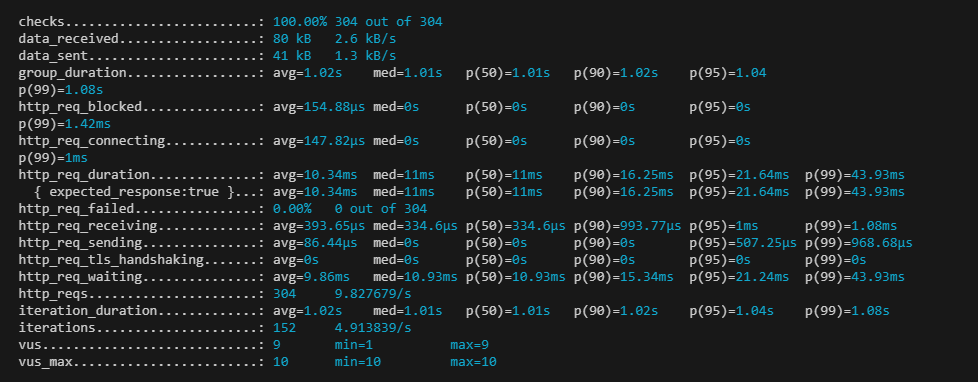

# URL Shortener

## Project Setup

Use branch -- branchA2

1. To install dependencies, move to folder and Run `npm i`
2. To setup local Sqllit Run
   `npx prisma migrate dev --name init `
3. To test api helth run `npm test `
4. To start server Run ` npm start`
5. To run load test please instat k6 on your systme
   the run `k6 run loadTest\simpletest.js `

# load test Results

For testing purpose tooke 30s as base time and will increase user count.

Q3. For 10 users

Q4. Increased users

| User | Avg    | P(50)  | p(90)  | p(95)  | p(99)   |
| ---- | ------ | ------ | ------ | ------ | ------- |
| 10   | 10 ms  | 11 ms  | 16 ms  | 21 ms  | 43 ms   |
| 100  | 74 ms  | 32 ms  | 200 ms | 282 ms | 537 ms  |
| 200  | 300 ms | 152 ms | 152 ms | 1.23 s | 1.91s   |
| 500  | 1.26 s | 987 ms | 2.68s  | 3s     | 4.07sec |
| 1000 | 4.2 s  | 2.29s  | 15.2s  | 18s    | 16s     |

## ORM

1.  orm quries are shorte and easy to write
2.  It prevent any sql injecting techiniques
3.  it has database migration so easy to change database
4.  easy to write complex quries like joins

Q7. if same longurl sent again it will send pervious code only will not generate new one

Q8.
it will give 404 error

q9
delete request on /shorten
